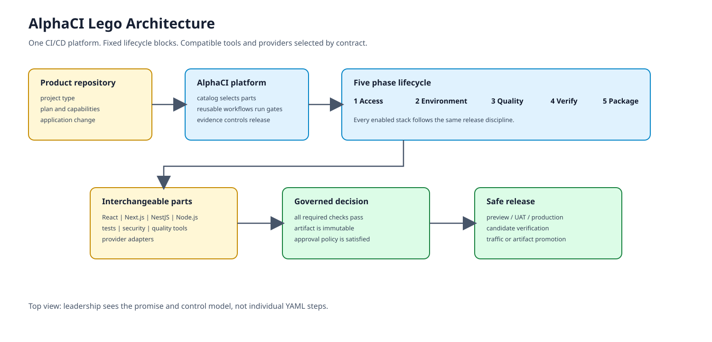
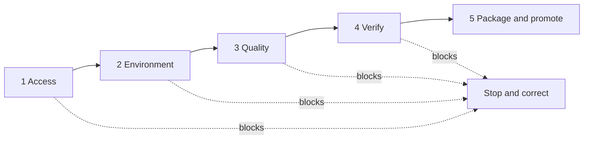

# Layer 1: Top View

## CPO summary

AlphaCI is a CI/CD platform that turns a product repository into a controlled delivery path. A product selects a supported project profile; AlphaCI supplies the reusable workflow, checks the change, produces evidence, and promotes an immutable artifact only when policy allows it.

The Lego metaphor is operational: the lifecycle and gates are fixed building blocks, while stack tools, commands and deployment providers are compatible pieces selected by configuration.

## The five platform phases

| Phase | Business meaning | Release question |
| --- | --- | --- |
| Access | Is this pipeline trusted and authorized? | May execution begin? |
| Environment | Is the dependency, branch and environment context acceptable? | Is the run safe to evaluate? |
| Quality | Does the change meet engineering standards? | Is the code fit to verify? |
| Verify | Does the system behave correctly in a representative environment? | Is the release proven? |
| Package and promote | Is the output immutable and approved for the target environment? | May traffic or artifacts be released? |

## Executive outcome

- **Faster onboarding:** a generated caller replaces hand-built CI/CD setup.
- **Consistent controls:** security, quality, evidence and promotion rules are centrally maintained.
- **Controlled flexibility:** products can use supported stacks without creating a separate pipeline architecture.
- **Safer change:** candidate artifacts are verified before promotion.

## Current platform position

The enabled customer catalog currently centers on Next.js, React, NestJS and Node.js project types, with GCP Cloud Run as the active recipe deployment path. Mobile, .NET, additional repository shapes and other providers are extension candidates until their catalog, caller, workflow and validation contracts are complete.

## Decision rule

A capability is customer-ready only when the catalog entry, generated caller, required setup, reusable workflow contract and validation checks agree. A workflow file or document by itself is not an enabled platform feature.
