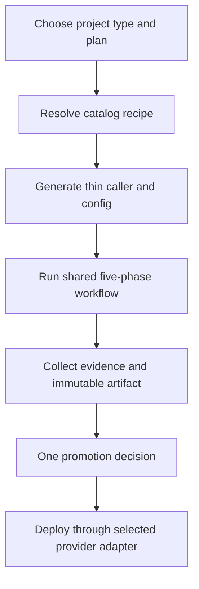

# Layer 1 Reference: CPO Plug-and-Play Workflow Strategy

This document is the executive view. Start with [01-top-view.md](01-top-view.md) for the compact diagram, then use [01-execution-view.md](../02-execution-view/01-execution-view.md) and [01-implementation-view.md](../03-implementation-view/01-implementation-view.md) when more detail is needed.

## Executive decision

Adopt a catalog-driven, reusable-workflow platform as the standard delivery model. Each product repository receives a generated thin caller. The caller selects a project profile and capabilities; central versioned workflows assemble the appropriate tools, gates, artifacts, and deployment adapter.

The organization gets one delivery control model with interchangeable implementation parts. Teams can change a supported stack or tool without redesigning the full pipeline.

## What the platform is solving

Without a common contract, every product team recreates CI/CD decisions: how to test, what blocks promotion, how secrets are passed, and how deployment is verified. This creates inconsistent controls, duplicated maintenance, and unclear ownership.

The plug-and-play model moves those decisions into a central platform while keeping product-specific configuration at the repository boundary.

## Target operating model

### The five phases

1. **Access gate:** establish trust, validate subscription and prevent secret exposure.
2. **Environment guard:** check dependencies, runtime assumptions, branch policy and required setup.
3. **Quality gate:** enforce lint, type safety, build, tests, coverage and static analysis.
4. **Verify:** prove behavior in unit, integration, E2E, smoke, health and performance checks.
5. **Package and promote:** create immutable artifacts, record evidence, obtain required approval and deploy.

## Business value

| Outcome | Why it matters |
| --- | --- |
| Faster onboarding | A new repository receives a working caller from a known recipe instead of hand-building CI/CD. |
| Consistent risk controls | Security, quality and promotion gates are centrally maintained. |
| Lower platform maintenance | Fixes to reusable workflows benefit every enabled consumer. |
| Stack flexibility | Frontend, backend, mobile and future runtimes can use one lifecycle contract. |
| Clear accountability | Product teams own application code and configuration; the platform team owns orchestration and guardrails. |
| Safer releases | Evidence, immutable artifacts, approvals and candidate deployment reduce release uncertainty. |

## What is already real

The repository already contains the foundation for this model:

- Customer project types and recipes for Next.js, React, NestJS and Node.js.
- Catalog action and plan metadata for capability and entitlement selection.
- Customer caller templates and a generated project contract.
- Reusable workflows for tests, security, deployment, UAT and promotion.
- Mobile and .NET workflow assets that can serve as extension candidates after catalog enablement.
- An active GCP Cloud Run path using Artifact Registry and OIDC/WIF.

The distinction is important: a workflow file or document is not automatically an enabled customer product feature. A capability becomes customer-ready only when its catalog entry, generated caller, required setup, workflow contract and validation checks agree.

## Operating responsibilities

**Platform team**

- Own reusable workflow releases and compatibility contracts.
- Maintain catalog actions, plans, recipes and project types.
- Maintain provider and tool adapters.
- Enforce security, permissions, evidence and promotion policy.
- Provide migration and rollback procedures.

**Product teams**

- Maintain application code and repository configuration.
- Provide required variables, secrets and environment approvals.
- Keep declared build, test, lint and health commands valid.
- Resolve failed gates rather than bypassing them.

**Governance and security**

- Approve new tools, providers and plan entitlements.
- Review changes to blocking thresholds and production gates.
- Require immutable workflow references and least-privilege permissions.
- Audit release evidence and exceptional hotfixes.

## Rollout recommendation

### Stage 1: Standardize the contract

Make the generated caller, `cicd.config.json`, catalog compatibility rules and workflow release policy the mandatory onboarding path for new repositories.

### Stage 2: Prove repeatability

Onboard representative Next.js, React, NestJS and Node.js repositories. Measure provisioning success, rerun safety, time to first green pipeline, gate failures and rollback behavior.

### Stage 3: Expand by adapter

Enable fullstack, mobile, .NET and additional deployment providers only after each adapter passes the same contract tests and produces equivalent evidence.

### Stage 4: Operate as a product

Publish workflow release notes, deprecation windows, support ownership, service-level targets and a capability roadmap tied to measured adoption and failure data.

## Success measures

- Time from repository request to first successful pipeline.
- Percentage of repositories using generated thin callers.
- Percentage of pipeline logic maintained centrally.
- Gate bypasses and production rollback frequency.
- Mean time to resolve a failed quality or deployment gate.
- Reprovisioning success rate after a partial failure.
- Adoption and failure rate by stack, recipe and provider.

## Decisions required

1. Confirm the five-phase workflow contract as the organization-wide release standard.
2. Confirm the platform team as owner of reusable workflow releases and catalog compatibility.
3. Confirm `test -> uat -> main` as the default promotion flow, with documented product exceptions.
4. Confirm GCP Cloud Run as the default active deployment path until another provider passes the adapter contract.
5. Fund the validation and onboarding work needed before enabling reserved repo shapes and extension stacks.

## Risks and controls

| Risk | Control |
| --- | --- |
| A flexible catalog becomes difficult to govern | Version schemas, validate compatibility, and require approval for new actions. |
| Central workflow changes break consumers | Use stable release tags, contract tests, release notes and deprecation windows. |
| Secrets or permissions expand unnecessarily | Use environment-scoped secrets, OIDC/WIF and least-privilege permissions. |
| Unsupported features appear production-ready | Mark catalog capability as enabled only after end-to-end onboarding validation. |
| One provider becomes a platform dependency | Keep deployment behind a provider adapter with standard artifact and health outputs. |

## Recommendation

Proceed with the Lego Architecture model as the platform blueprint. Treat the catalog and reusable workflow contract as the product boundary, and treat individual tools, stacks and providers as replaceable adapters. This gives leadership a controlled path to standardization without locking every product team into one implementation forever.

Technical reference: [02-technical-architecture.md](../02-execution-view/02-technical-architecture.md) and [02-technical-architecture.svg](../02-execution-view/02-technical-architecture.svg).
