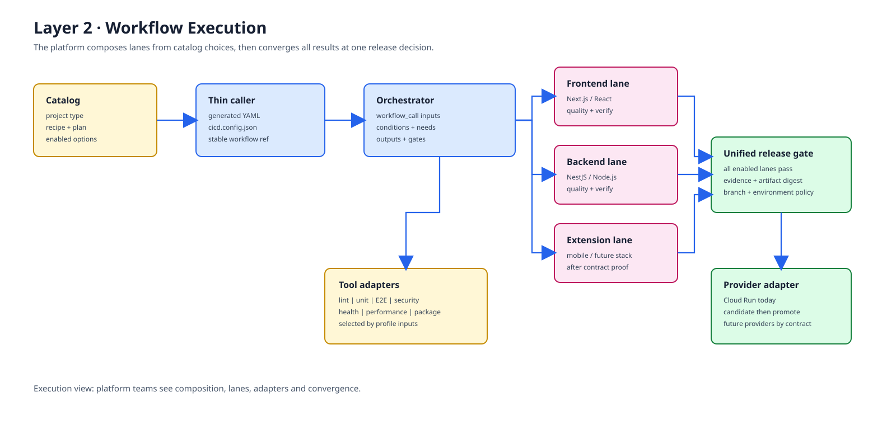
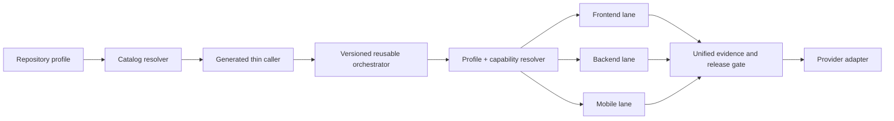

# Layer 2: Execution View

## Purpose

This layer explains how AlphaCI composes a delivery run from reusable parts. It is the platform team's view: enough detail to understand ownership, switching and convergence without listing every YAML step.

## Plug-and-play rules

| Boundary | Stable part | Variable part |
| --- | --- | --- |
| Repository to platform | `workflow_call` contract and generated caller shape | Project type, recipe, commands, paths and flags |
| Catalog to workflow | Compatibility and entitlement rules | Enabled actions, plan and deployment provider |
| Orchestrator to lane | Five phases, pass/fail result and evidence | Frontend, backend, mobile or matrix profile |
| Lane to tool | Inputs, exit status, reports and artifact conventions | ESLint, tests, Playwright, Bruno, k6, Maestro or another approved adapter |
| Gate to provider | Immutable artifact, health result and deployment status | GCP Cloud Run today; future providers after contract validation |

## Flow

1. The product request selects a repository shape, project type, plan and recipe.
2. The catalog resolver rejects unsupported combinations before provisioning.
3. Provisioning writes a thin caller, `cicd.config.json` and setup instructions.
4. The caller invokes a stable reusable workflow release; it does not copy central logic.
5. The profile resolver expands only compatible capabilities and lanes.
6. Enabled lanes run the same five-phase contract, in parallel where safe.
7. Results, reports and immutable artifact metadata converge at one release gate.
8. The selected provider adapter deploys only after branch and environment policy passes.

## Ownership model

- `catalog/` selects and entitles capabilities.
- `workflow-templates/customer/` composes generated callers.
- `.github/workflows/` executes reusable jobs and owns gates.
- Consumer repositories own application commands, variables, secrets and approvals.
- `scripts/` and workflow contract docs validate the boundary.

## What this layer must not do

It must not promise every workflow file is enabled for every customer, or imply that a tool can be swapped without compatibility checks. The catalog and contract validation are the product control points.
