# Layer 2 Reference: Plug-and-Play Workflow Execution

This document is the platform execution view. Use [01-top-view.md](../01-top-view/01-top-view.md) for the CPO summary and [01-implementation-view.md](../03-implementation-view/01-implementation-view.md) for concrete YAML contracts and provider details.

## Status

This is the technical companion to [02-technical-architecture.svg](02-technical-architecture.svg). It is the proposed general operating model for making AlphaCI workflows composable without copying pipeline logic into every consumer repository.

The repository evidence used for this model is:

- `catalog/customer/project-types.json`
- `catalog/customer/workflow-recipes.json`
- `catalog/actions.json`
- `catalog/plans.json`
- `docs/generated-project-contract.md`
- `.github/workflows/`
- `workflow-templates/customer/`

## Core idea

A consumer repository receives a small, generated caller. The caller supplies configuration and references a versioned reusable workflow. The reusable workflow resolves the selected profile, enables compatible capabilities, runs the same five-phase contract, and exposes artifacts and evidence to a single promotion gate.

```mermaid
flowchart LR
    REQUEST[Product request<br/>repo shape + stack + plan] --> CATALOG[Catalog resolver<br/>project type + recipe + actions]
    CATALOG --> CALLER[Generated thin caller<br/>workflow + cicd.config.json]
    CALLER --> CONTRACT[Versioned workflow_call contract]
    CONTRACT --> PROFILE[Profile and variable resolver]
    PROFILE --> PHASES[Five-phase runner]
    PHASES --> EVIDENCE[Artifacts + reports + digest]
    EVIDENCE --> GATE[Unified promotion gate]
    GATE --> PROVIDER[Deployment adapter]
```



## How interchange works

Interchange is configuration-driven at the caller boundary and adapter-driven inside the reusable workflow. A stack changes the profile and tool adapter; it does not create a new orchestration model.

```yaml
profile:
  project_type: nextjs-app
  recipe: frontend-standard-ci
  repo_shape: single-app
  branch_flow: test-uat-main
  provider: gcp-cloud-run
  capabilities:
    lint: true
    unit: true
    coverage: true
    security: true
    docker: true
    e2e: false
```

The resolver validates that:

1. The project type is supported by the selected recipe.
2. The plan permits each selected action.
3. Required variables and secrets are declared before execution.
4. The selected adapter supports the stack and provider.
5. The caller references a stable workflow release, never `@main`.

## Runtime flow

### 1. Selection and provisioning

The catalog maps a repository shape and project type to a recipe and caller template. The generated project contract requires a thin caller, `cicd.config.json`, and setup instructions. Provisioning is idempotent: existing matching files are not rewritten, and missing provider setup is reported rather than silently stored.

### 2. Reusable orchestration

The shared workflow owns permissions, concurrency, job dependencies, outputs, conditions, and gate behavior. Consumer callers do not duplicate those decisions. Frontend and backend lanes may run in parallel; a fullstack or multi-language run converges at one release decision.

### 3. Five-phase execution

| Phase | Contract | Example interchangeable tools |
| --- | --- | --- |
| Access gate | Trust, subscription, caller and secret-exposure checks | `validate-subscription.yml`, Gitleaks |
| Environment guard | Dependency, runtime, branch and environment readiness | npm audit, NuGet audit, branch policy |
| Quality gate | Formatting, lint, types, build, coverage and static analysis | ESLint, Prettier, Sonar, Roslyn |
| Verify | Unit, integration, E2E, smoke, health and performance proof | Vitest, xUnit, Playwright, Bruno, k6, Maestro |
| Package | Immutable deployable output plus evidence | Docker, Artifact Registry, mobile artifacts, SBOM |

The contract remains stable even when the tool adapter changes. A tool is eligible only when it supports the resolved stack and its required variables or secrets are present.

### 4. Promotion and deployment

The promotion gate consumes all enabled lane results and artifact metadata. The baseline branch flow is `test -> uat -> main` for the tribe rules; product-specific deployment documentation may require an additional production branch or environment approval. The current GCP path is Artifact Registry to Cloud Run, using OIDC/WIF, a no-traffic candidate revision, an authenticated health probe, and traffic promotion after verification.

## Current capability versus extension boundary

| Area | Verified repository capability | Extension boundary |
| --- | --- | --- |
| Frontend | Next.js and React project types; shared frontend workflows | Add another profile and adapter without changing the phase contract |
| Backend | NestJS and Node.js project types; shared backend workflows | Add .NET or another runtime after catalog and workflow contract validation |
| Mobile | Mobile workflow files and caller documentation exist | Enable mobile repo shapes and catalog entries when the provisioning contract is complete |
| Deployment | GCP Cloud Run is the active recipe provider; Vercel/Render workflows remain present | Add a provider adapter with the same artifact, health, and promotion outputs |
| Repository shapes | `single-app` is enabled in the customer project catalog | Enable fullstack, monorepo, mobile, or library shapes after end-to-end validation |

This distinction prevents the diagram from presenting documented or reserved paths as already enabled customer catalog features.

## Repository ownership map

| Concern | Owner |
| --- | --- |
| Selection and entitlements | `catalog/` |
| Generated caller composition | `workflow-templates/customer/` |
| Runtime orchestration | `.github/workflows/` |
| Stack and provider adapters | reusable workflows and their inputs |
| Contract validation | `scripts/` and workflow validation |
| Consumer setup | generated `cicd.config.json`, repository variables, secrets, and environments |
| Architecture intent | `Lego Architecture/` |

## Non-negotiable implementation rules

- Generated callers stay thin and reference a stable release such as `@v1`.
- Reusable workflows use explicit permissions, concurrency, job dependencies, and outputs.
- Secrets are referenced, not copied into generated files or artifacts.
- Cloud deployment uses OIDC/WIF instead of long-lived provider keys where supported.
- Every enabled lane must produce a pass/fail result before promotion.
- Failed gates stop promotion; they do not get bypassed by changing variables.
- New tools and providers must implement the existing input/output contract and include catalog compatibility tests.
