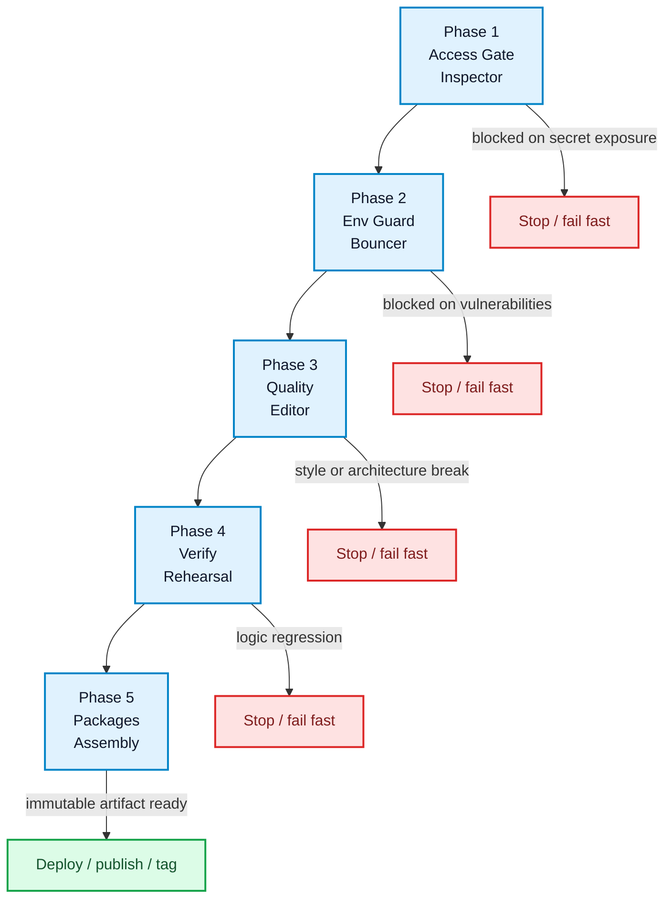
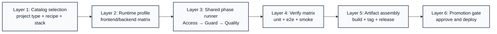
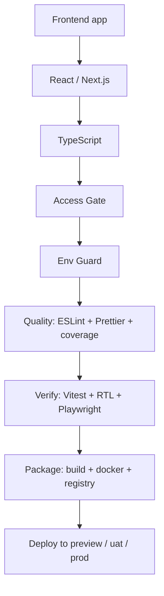
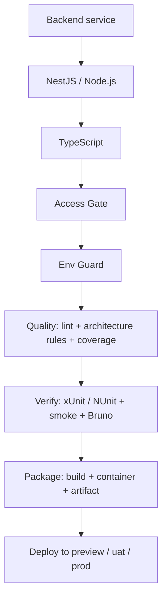
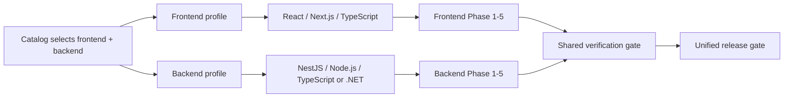

# Plug-and-Play CI/CD Strategy

## Purpose

This document defines the final AlphaCI pattern for plug-and-play workflow orchestration. It is intentionally modeled around the repository's actual architecture: reusable GitHub Actions workflows, customer caller templates, catalog-driven project selection, and variable-based runtime switching.

The operating model is five phases, not five unrelated jobs:

1. Access gate
2. Environment guard
3. Quality gate
4. Verify and rehearsal
5. Package and deploy assembly

This model is the final v1 reference used by the platform. Draft variants v2.0, v3.0, and v4.0 remain hosting-specific alternatives, not the default orchestration pattern.

---

## 1) Canonical five-phase flow



### Phase mapping to real tools

| Phase | Role | Frontend tools | Backend tools | Platform notes |
| --- | --- | --- | --- | --- |
| 1 | Access Gate | Gitleaks | Gitleaks | Blocks exposed credentials, invalid subscription, or no-trust configuration |
| 2 | Env Guard | npm audit | NuGet Audit | Dependency and runtime vulnerability guard |
| 3 | Quality | Prettier, ESLint, SonarCloud | dotnet format, Roslyn Analyzers, NetArchTest.Rules | Standards and architecture rules |
| 4 | Verify | Vitest, React Test Library, Playwright, MSW | xUnit, NUnit, NSubstitute, Coverlet, Bruno | Proof of business logic and deploy readiness |
| 5 | Packages | tsc --noEmit, npm run build, Docker Build & Tag | Docker Build & Tag, package checks | Immutable deployment units |

---

## 2) Real repository alignment

The repository already implements the pattern with reusable workflows and a generated caller structure:

- Access validation: validate-subscription.yml
- Quality and security: frontend-tests.yml, backend-tests.yml, mobile-tests.yml, security-scan.yml, lint-check.yml
- Branch policy: branch-policy.yml
- UAT and release gates: reusable-web-uat.yml, reusable-service-uat.yml, production-gate.yml
- Deployment: gcp-cloud-run-deploy.yml
- Catalog and selection: catalog/customer/project-types.json and workflow-recipes.json
- Customer caller templates: workflow-templates/customer/*.yml

That means the final model is not a bespoke one-off. It is a reusable platform contract with a catalog-driven entry point.

---

## 3) Variable-driven interchange model

The system should be designed so the same orchestration layer can run with different inputs rather than different code paths.

### 3.1 Canonical switch variables

```yaml
variables:
  platform:
    mode: "frontend|backend|fullstack|multi-language"
    provider: "gcp-cloud-run"
    branch_policy: "test|uat|prod"

  frontend:
    language: "typescript|javascript|react|nextjs"
    framework: "react|nextjs"
    package_manager: "npm|pnpm|yarn"
    build_command: "npm run build"
    test_command: "npm run test"
    lint_command: "npm run lint"

  backend:
    language: "typescript|javascript|dotnet|python"
    framework: "nestjs|nodejs|aspnetcore"
    package_manager: "npm|dotnet|pip"
    build_command: "npm run build|dotnet build"
    test_command: "npm run test|dotnet test"
    lint_command: "npm run lint|dotnet format --verify-no-changes"

  runtime:
    target: "preview|uat|prod"
    deploy_mode: "candidate-no-traffic|promote-after-health"
    registry: "artifact-registry"
```

### 3.2 Switch logic

```text
if frontend.enabled
   run phase-1..phase-5 using frontend profile
if backend.enabled
   run phase-1..phase-5 using backend profile
if both frontend and backend enabled
   run in parallel layers, then merge verification and release gate
if multi-language.enabled
   expand matrix by language and framework, then run the same phase contract per app
```

This preserves the same pipeline contract while allowing each language stack to resolve its own commands, coverage thresholds, and deployment targets.

---

## 4) Layered orchestration model

The key design idea is a layer system that always completes the full quality lifecycle before release.



### Layer responsibilities

- Layer 1: select stack and recipe from the catalog
- Layer 2: resolve runtime profile and switch variables
- Layer 3: enforce the gating phases for every enabled service
- Layer 4: execute test and smoke verification for each language stack
- Layer 5: package immutable artifacts and publish to registry
- Layer 6: branch and environment policy enforcement; only then release

---

## 5) Frontend and backend language support

### Single-language frontend path



### Single-language backend path



### Multi-language fullstack path



This is the key pattern for mixed-language repositories: the same phase contract runs per stack, then the platform merges both results into one release decision.

---

## 6) Multi-stack foldering plan

The repository should keep orchestration, catalog, and stack profile definitions clearly separated.

```text
.github/
  workflows/
    phase-access-gate.yml
    phase-env-guard.yml
    phase-quality.yml
    phase-verify.yml
    phase-package.yml
    orchestrators/
      frontend-single.yml
      backend-single.yml
      fullstack-multi.yml
      multi-language-matrix.yml

catalog/
  customer/
    project-types.json
    workflow-recipes.json
    language-matrix.json
    stack-switches.json

workflow-templates/
  customer/
    fe-nextjs.yml
    fe-react.yml
    be-nodejs.yml
    be-nestjs.yml
    fullstack-multi.yml

scripts/
  validate-stack-matrix.cjs
  validate-workflow-contract.cjs

examples/
  demo-app/
    frontend/
    backend/
    fullstack/

docs/
  workflows/
  plans/
  plug-and-play-strategy.md
```

### Why this foldering works

- `workflows/` owns runtime logic
- `catalog/` owns selection and policy
- `workflow-templates/` owns generated caller composition
- `scripts/` owns validation and contract safety
- `examples/` provides reference implementations
- `docs/` owns platform-level architecture intent

---

## 7) Default policy for platform teams

### Recommended default

- Frontend: TypeScript-first, React or Next.js
- Backend: TypeScript-first, Node.js/NestJS; .NET supported as an explicit backend profile
- Multi-language repos: run each stack through the same phase contract, then gate on the worst result and the final release gate
- Branch policy: `test -> uat -> prod` for open-flow product repos; keep `main` as validation baseline only when product override requires it

### Release gate principle

The release decision should be made only after all enabled stacks complete:

```text
all access gates pass
AND all environment guards pass
AND all quality checks pass
AND all verify jobs pass
AND all artifacts are packaged and immutable
THEN allow promotion
```

This keeps the platform consistent even when the selected language and framework differ.

---

## 8) Decision summary

The final plug-and-play architecture is a layered workflow contract:

- same five-phase lifecycle
- different stack inputs
- shared release policy
- variable-driven switching
- runtime matrix support for frontend, backend, and fullstack multi-language repos

That gives the organization a platform that is both opinionated and universal: it enforces the same CI/CD discipline while remaining flexible enough for React, Next.js, NestJS, Node.js, and .NET service combinations.
