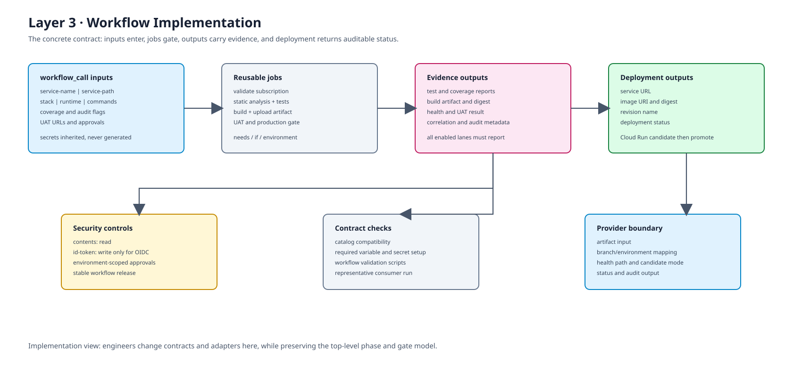
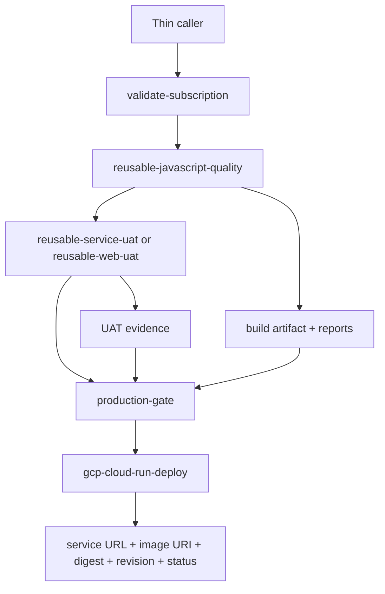

# Layer 3: Implementation View

## Purpose

This is the engineer's view of the contract that makes the Lego model executable. It is intentionally concrete: inputs enter through `workflow_call`, jobs enforce dependencies, outputs carry evidence forward, and provider adapters expose safe deployment results.

## Reusable workflow contract

A stack workflow such as `service-nextjs.yml` or `service-nestjs.yml` accepts stable inputs such as:

- service identity: `service-name`, `service-path`, `stack-name`
- runtime: `node-version`, `package-manager`
- commands: install, lint, format, typecheck, test, build and UAT commands
- policy switches: coverage threshold, audit, license, attestation and approvals
- verification: UAT URL, health check, browser, k6 and test paths

The caller supplies values; the reusable workflow owns job structure and gate behavior.

## Job and data flow

## Concrete implementation controls

| Control | Repository implementation | Purpose |
| --- | --- | --- |
| Authorization | `validate-subscription.yml` with `CI_TOKEN` | Stop unauthorized runs before quality work |
| Permissions | `contents: read`; deployment adds `id-token: write` | Least privilege and OIDC authentication |
| Quality | `reusable-javascript-quality.yml` | Static analysis, tests, coverage, audit, license and build outputs |
| UAT | `reusable-service-uat.yml`, `reusable-web-uat.yml` | Validate health, smoke, browser and performance behavior |
| Promotion | `production-gate.yml`, branch/environment conditions | Require policy and approval before release |
| Deployment | `gcp-cloud-run-deploy.yml` | Validate branch mapping, build image, push, probe candidate and report status |
| Evidence | workflow outputs, artifacts, reports, digest and correlation ID | Make the release decision auditable |

## Provider adapter contract

A deployment provider must accept a system identity, target environment, source branch, artifact inputs and health path. It must return:

- deployable artifact URI
- immutable digest
- revision or equivalent deployment identity
- service URL or endpoint
- health result
- deployment status
- correlation or audit identifier

The current Cloud Run adapter additionally enforces `dev -> preview`, `uat -> uat` and `main -> prod` branch/environment mappings, uses OIDC/WIF, and supports a no-traffic candidate before promotion.

## Security and reliability requirements

- Generated callers reference a stable release such as `@v1`, never `@main`.
- Secrets remain in GitHub or provider secret stores and are passed only to jobs that need them.
- Marketplace actions should be pinned to immutable SHAs where the workflow contract permits.
- Every enabled lane must return a result before the promotion gate can pass.
- Artifacts are immutable inputs to promotion; rebuilds must be deliberate and traceable.
- New adapters require catalog compatibility, workflow contract tests and an onboarding proof before enablement.

## Change workflow

1. Add or modify the workflow contract.
2. Update catalog compatibility and required setup.
3. Update the generated caller or template.
4. Add contract and behavior validation.
5. Run a representative consumer pipeline.
6. Publish a versioned workflow release and migration note.
