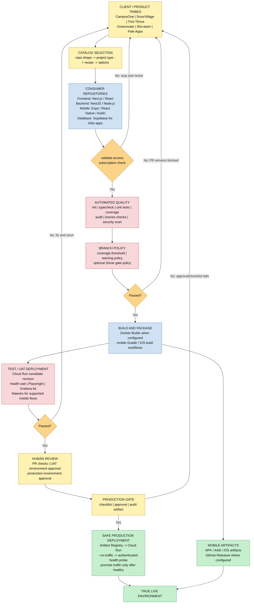

# AlphaCI CI/CD Architecture Diagram Reference

This is the expanded reference for the three-layer Lego Architecture model. The concise entry point is [README.md](../README.md). Use one view at a time instead of presenting every implementation detail in a single diagram.

The active views are:

- [01-top-view.svg](../01-top-view/01-top-view.svg) — CPO-level lifecycle, value and five phases.
- [01-execution-view.svg](../02-execution-view/01-execution-view.svg) — catalog, callers, reusable workflows, lanes and release convergence.
- [01-implementation-view.svg](../03-implementation-view/01-implementation-view.svg) — workflow inputs, jobs, outputs, security and provider contract.
- [01-cicd-architecture-v1.svg](01-cicd-architecture-v1.svg) — original canonical v1 reference retained for historical continuity.

The historical variants are stored under `dump/architecture-archive/` and are not active architecture sources.

## Definitions of terms by layer

### Layer 1: Clients and catalog entry

- **Client / product tribe:** A consumer team or product repository represented by names such as CampusOne or Greenovate. These names come from the supplied reference diagram; their application code is not stored in this repository.
- **Consumer repository:** The external application repository that receives a generated caller workflow.
- **Catalog:** The metadata in `catalog/customer/` that selects a project type, starter kit, workflow recipe, and supported options.
- **Project type:** A supported application shape such as `nextjs-app`, `react-spa`, `nestjs-api`, or `nodejs-api`.
- **Workflow recipe:** A named pipeline configuration that maps a project type to a customer caller template and optional jobs.

### Layer 2: Consumer repositories and data

- **Frontend:** A web application using Next.js or React, normally with TypeScript.
- **Backend:** An API or service using NestJS or Node.js. The repository supports TypeScript backend workflows; the exact framework is selected by the project type.
- **Mobile:** An Expo, React Native, or Kotlin/Android application supported by the mobile workflows.
- **Database:** The application data store. Supabase is the approved database direction for tribe applications; it is not a database hosted by this workflow repository.
- **Caller workflow:** A small YAML workflow copied into the consumer repository. It passes project-specific inputs to central reusable workflows.

### Layer 3: Reusable CI, testing, and build

- **Reusable workflow:** A central GitHub Actions workflow triggered with `workflow_call`, such as `frontend-tests.yml`, `security-scan.yml`, or `gcp-cloud-run-deploy.yml`.
- **Access validation:** The first customer-caller job, represented by `validate-subscription.yml`, which checks whether the pipeline may run.
- **Quality gate:** The collection of required checks such as lint, typecheck, unit tests, coverage, dependency audit, and license validation.
- **Branch policy:** Central rules resolved by `branch-policy.yml`, including coverage thresholds, warning behavior, and optional Sonar gate settings. It is not itself a SonarCloud scanner.
- **xUnit:** The .NET test framework that executes backend unit and integration test cases and reports their results.
- **NSubstitute:** A .NET test-double library used with xUnit to substitute backend dependencies, such as repositories or external services, during unit tests.
- **Candidate revision:** A Cloud Run revision deployed without receiving production traffic. It is tested before traffic is promoted.

### Layer 4: UAT and governance

- **UAT:** User acceptance testing against a test or UAT deployment, implemented through the reusable service/web UAT workflows where configured.
- **Environment approval:** A GitHub Environment reviewer checkpoint. It provides human approval before the gated job continues.
- **Governance / change control:** Repository and central workflow rules that enforce branch, quality, approval, and promotion requirements.
- **Production gate:** `production-gate.yml`, which performs the production-readiness checklist, uses the production environment, and records an audit artifact.
- **Promotion block:** A failed check or rejected approval that prevents merge, deployment, or traffic promotion until the change is corrected and rerun.
- **Bruno:** An API client and CLI runner used here for post-deployment UAT/smoke requests against the running backend. Unlike xUnit/NSubstitute, Bruno exercises HTTP behavior across the deployed system.

### Layer 5: Safe release and live environment

- **Artifact Registry:** Google Cloud's container image registry used by the GCP deployment workflow.
- **Cloud Run:** The managed container runtime targeted by the current GCP deployment path.
- **Workload Identity Federation (WIF):** GitHub OIDC-based cloud authentication that avoids static service-account key files.
- **No-traffic deployment:** A deployment mode where the new Cloud Run revision receives no user traffic while it is being validated.
- **Authenticated health probe:** A request using an identity token to verify the private candidate revision is healthy.
- **Traffic promotion:** Moving service traffic to the verified candidate revision.
- **Mobile artifact:** A generated Android or iOS build output, published through the configured mobile/release workflow path.

## Rendered diagram



## Plain-text fallback

```text
[CLIENT / PRODUCT TRIBES]
 CampusOne | SmurVillage | Trini-Thrive | Greenovate | Sho-team | Paki-Apps
                              |
                              v
[CATALOG]
 repo shape -> project type -> workflow recipe -> options
                              |
                              v
[CONSUMER REPOSITORY]
 Frontend | Backend | Mobile | Supabase database
                              |
                              v
[validate-access]
      No --------------------> revise / rerun from the beginning
      Yes
       |
       v
[AUTOMATED QUALITY]
 lint | typecheck | unit + coverage | audit | license | security
       |
       v
[BRANCH POLICY + QUALITY GATE] ---- No ----> PR remains blocked; revise
       |
      Yes
       v
[BUILD AND PACKAGE]
 Docker Buildx and/or mobile Gradle / iOS build workflows
       |
       v
[TEST / UAT DEPLOYMENT]
 Cloud Run candidate | health wait | Playwright | k6 | Maestro
       |
       v
[UAT GATE] ----------------------- No ----> revise / rerun
       |
      Yes
       v
[PR + UAT / PRODUCTION APPROVAL]
       |
       v
[PRODUCTION GATE] ----------------- No ----> approval/checklist correction
       |
      Yes
       v
[SAFE CLOUD RUN DEPLOYMENT]
 Artifact Registry -> --no-traffic candidate -> authenticated probe
                                      |
                                      v
                            [TRUE LIVE ENVIRONMENT]

Mobile artifacts can branch from the build stage and publish through
configured GitHub Release workflows.
```

## Repository mapping

| Diagram area | Repository source |
| --- | --- |
| Catalog selection | `catalog/customer/` |
| Consumer caller workflows | `workflow-templates/customer/` |
| Access validation | `.github/workflows/validate-subscription.yml` |
| Quality and security | `.github/workflows/lint-check.yml`, `frontend-tests.yml`, `backend-tests.yml`, `mobile-tests.yml`, `security-scan.yml` |
| Branch governance | `.github/workflows/branch-policy.yml` |
| UAT | `.github/workflows/reusable-service-uat.yml`, `.github/workflows/reusable-web-uat.yml` |
| Production approval | `.github/workflows/production-gate.yml` |
| GCP deployment | `.github/workflows/gcp-cloud-run-deploy.yml` |
| Workflow contracts | `docs/workflows/` and `scripts/` |

## Important interpretation notes

- The six tribe names come from the supplied architecture reference; they are not application directories in this repository.
- The diagram shows a conceptual fail-and-revise loop. GitHub Actions does not literally restart a customer pipeline at the client row; failed checks block or fail the run until the change is corrected and rerun.
- The GCP deployment path uses GitHub OIDC Workload Identity Federation, deploys a candidate without traffic, probes it, and promotes traffic only after the probe succeeds.
- Mobile release details depend on which mobile workflow and caller options are enabled. This diagram does not claim a single `mobile-release-build.yml` workflow exists.
